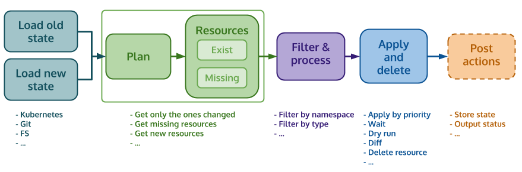
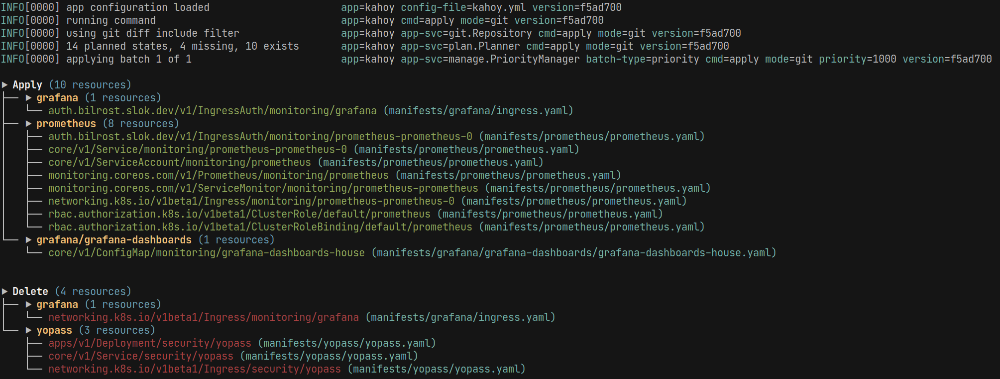
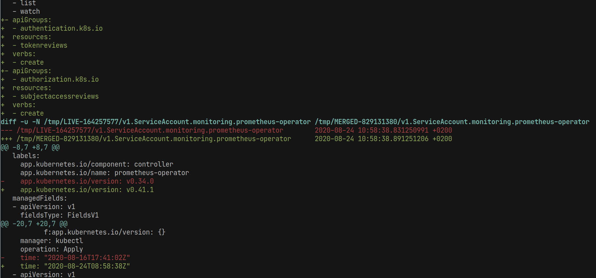

<p align="center">
    
</p>

# Kahoy

[![Build Status][ci-image]][ci-url] [![Go Report Card][goreport-image]][goreport-url]

> When [Kubectl] is too simple for your needs and available deployment solutions too complex.

Maintain Kubernetes resources in sync easily.


---

## :link: Table of contents

- [:tada: Introduction](#tada-introduction)
- [:checkered_flag: Features](#checkered_flag-features)
- [:shipit: Install](#shipit-install)
- [:key: Getting started](#key-getting-started)
- [:mag: Scope](#mag-scope)
- [:pencil2: Concepts](#pencil2-concepts)
- [:wrench: How does it work](#wrench-how-does-it-work)
- [:computer: Execution options](#computer-execution-options)
- [:page_facing_up: Manifest source providers](#page_facing_up-manifest-source-providers)
- [:bulb: Use cases](#bulb-use-cases)
- [:question: F.A.Q](#question-faq)
- [:tophat: Alternatives](#tophat-alternatives)
- [:octocat: Contributing](#octocat-contributing)

## :tada: Introduction

You probably noticed a big gap between what can be done with kubectl and more advanced tools like Helm and FluxCD. But.. what about all the cases where we just need a bit more than what kubectl can offer?

Kahoy is a minimal and flexible tool to deploy your Kubernetes **raw** manifest resources to a cluster.

It's based on GitOps principles, and **out of the box** Kubernetes resources. It does not need apps/releases/services/or any other Custom Resource Definitions to manage deployments.

Kahoy will adapt to your needs and not the other way around, its been designed and developed to be generic and flexible enough for raw manifests without adding unneeded complexity.

## :checkered_flag: Features

- Simple, flexible, and lightweight.
- Deploys a deletes Kubernetes resources.
- Deploy anything, a `Namespace`, `Ingress`, `CRD`, domain apps (e.g `Deployment`+`Service`)...
- Garbage collection resources.
- Load states from different sources/providers (fs, git, kubernetes...).
- Plans at Kubernetes resource level (not file/manifest level, not app/release level)
- Gitops ready (split commands, understands git repositories, apply only changes, Diff, Dry run...).
- Use full syncs or partial syncs based on resource changes/diffs.
- Deploy priorities.
- Multiple filtering options (file paths, resource namespace, types...).
- Push mode (triggered from CI), not pull (controller).
- Use Kubectl under the hood (Kubernetes >=v1.18 and server-side apply).
- Safe deletion of resources (doesn't use `prune` method to delete K8s resources).
- Reports of what applies and deletes (useful to combine with other apps, e.g: wait, checks, notifications...).

## :shipit: Install

- Docker: Ready image with all the required tools (e.g Kubectl) `docker pull slok/kahoy`.
- Releases: Go to [releases](https://github.com/slok/kahoy/releases).
- Build from source: `git clone git@github.com:slok/kahoy.git && cd ./kahoy && make build`.

## :key: Getting started

```bash
kahoy apply --kube-provider-id "ci" -n "./manifests"
```

Thats just one way of doing it, for more advanced ways of using Kahoy, check:

- `kahoy apply --help`.
- [Use cases](<(#bulb-use-cases)>) section.
- [Github actions example][github-actions-example].
- [Kustomize example][kustomize-example].

## :mag: Scope

- This tool does not perform any form of templating, the generation, and mutation of the YAMLs are out of the scope (We believe the are powerful tools that can be used together with Kahoy for that matter e.g kustomize+kahoy).
- Manage the lifecycle of Kubernetes resources using raw YAML files and GitOps.
- Run on CI (dry run, diff, apply)
- Simplicity and flexibility.
- Just a bit smarter than Kubectl.
- Plan what should change declaring current and previous states (read about this in the Concepts section)

If you need complex flows for your Kubernetes resources is likely that Kahoy is not for you.

## :pencil2: Concepts

Kahoy does not depend on any running service, labels or annotation selectors, or any other kind of app grouping concept. These are the only 3 concepts you need to know about:

### State

Kahoy plans what to apply or delete based on an `old` and a `new` state of manifests. These states can come from different sources:

- `paths`: Given 2 filesystem paths, it will use one for the old state and the other for the new state.
- `git`: Given 2 revisions (depends on the `git` provider), it will use the old git revision to get the manifest's state at that moment, and the new git revision to get the manifest's state on that moment.

### Resource

Is a Kubernetes resource, Kahoy will identify resources by type, namespace, and name, so, if the manifests file arrangement changes (grouping in files, splitting, rename...) it will not affect at the plan. E.g:

Having these 2 manifests:

`grafana.yaml`:

```yaml
---
apiVersion: apps/v1
kind: Deployment
metadata:
  name: grafana
  namespace: monitoring
#...
---
apiVersion: v1
kind: ServiceAccount
metadata:
  name: grafana
  namespace: monitoring
#...
---
apiVersion: v1
kind: Service
metadata:
  name: grafana
  namespace: monitoring
#...
```

`ingress.yaml`:

```yaml
apiVersion: networking.k8s.io/v1beta1
kind: Ingress
metadata:
  name: grafana
  namespace: monitoring
#...
```

Kahoy would load 4 resources with these IDs:

- `apps/v1/Deployment/monitoring/grafana`
- `core/v1/Service/monitoring/grafana`
- `core/v1/ServiceAccount/monitoring/grafana`
- `networking.k8s.io/v1beta1/Ingress/monitoring/grafana`

> Note: Because resources are identified by its `type`, `ns`, and `name`, you can move around in files without affecting how Kahoy will identify them.

### Groups

A group is a way of adding options (e.g deployment priority) to the resources in the group. You could have one or many based on what you need.

Kahoy will identify the groups from the directory structure that contains the manifests. See the following example:

Given this tree and our manifests root in `./manifests`

```bash
./manifests/
├── alertgram
│   ├── alertgram-secret.yaml
│   └── alertgram.yaml
├── bilrost
│   └── bilrost.yaml
├── root-stuff.yaml
└── grafana
    ├── config.yaml
    ├── grafana-dashboards
    │   ├── grafana-dashboards-kubernetes.yaml
    │   └── grafana-dashboards-provision.yaml
    ├── grafana.yaml
    └── ingress.yaml
```

These would be the group IDs:

- `alertgram`
- `bilrost`
- `root` (this is the root id).
- `grafana`
- `grafana/grafana-dashboards`

## :wrench: How does it work



- Load manifests into K8s resources.
  - Filter manifest at file level if required.
  - Load old state `Resource`s and `Group`s.
  - Load new state `Resource`s and `Group`s.
- Plan by comparing old and new states.
  - Get Exist resources (`Apply` plan).
  - Get Missing resources (`Delete` plan).
- Process K8s resources.
  - Filter resources at Kubernetes resource level if required (ns, type, label...).
- Manage resources.
  - Batch resources (e.g by priority).
  - Apply.
  - Delete.
- Post operations.
  - Store state.
  - ouput status.

## :computer: Execution options

### Dry-run

Will plan what resources need to exist on the cluster and what needs to be removed (client-side, no cluster required).



### Diff

Will get a diff against the server of the planned resources (server-side, cluster required).



### Default (Apply)

Will apply the resources that need to exist and delete the ones that don't. Apply uses Kubectl with [server-side][serverside-apply] apply.

## :page_facing_up: Manifest source providers

Kahoy needs two manifest states (old and new) to plan what resources need to exist/gone in the cluster. How these manifests are provided is using the `provider`

| Provider   | Easy | Flexible | Fast | History |
| ---------- | ---- | -------- | ---- | ------- |
| Kubernetes | ✔    | ✔        | ✖    | ✖       |
| Git        | ✖    | ✖        | ✔    | ✔       |
| Paths      | ✖    | ✔        | ✔    | ✖       |

### `kubernetes`

Given an storage ID and a namespace, at the end of the execution it will store the executed state (applied and deleted resources).

The ID is important because you can have different states for each Kahoy execution flows on the same cluster.

> Note: The state is stored with a `Secret` per existing resource. Be aware of [object count quota](https://kubernetes.io/docs/concepts/policy/resource-quotas/#object-count-quota)

With this state storage, it will load the `old` manifest state from Kubernetes and `new` manifest state from an fs path. This means that unlike other modes, using dry-run with Kubernetes provider needs access to a cluster.

This provider gives reliable and easy management, but is slower (Needs to get the state from the cluster) and requires space on the cluster to store the state (however the stored resources are compressed).

Example of usage:

```bash
kahoy apply \
  --provider "kubernetes" \
  --kube-provider-id "ci" \
  --fs-new-manifests-path "./manifests"
```

#### Check kahoy state

If you want to check all the resource states, you can do (Check `Secret` annotations for more information):

```bash
kubectl -n {STORAGE_NAMESPACE} get secrets -l 'kahoy.slok.dev/storage-id={STORAGE_ID}'
```

#### Move kahoy state

In case you want to move kahoy state to another namespaces you can get the resources and apply them in another namespace.

```bash
kubectl -n {STORAGE_OLD_NS}  get secrets -l 'kahoy.slok.dev/storage-id={STORAGE_ID}' -o json | \
  jq '.items[].metadata.namespace = "{STORAGE_NEW_NS}"' | \
  kubectl -n {STORAGE_NEW_NS} apply -f-
```

#### Delete kahoy state

In the strange case that you want to reset Kahoy state, you can do it by removing these secrets and apply again all the manifests to create the latest state again:

```bash
kubectl -n {STORAGE_NAMESPACE} delete secrets -l 'kahoy.slok.dev/storage-id={STORAGE_ID}'
```

### `paths` (File system)

Given 2 manifest file system paths, plans what needs to be applied against a cluster, and what needs to be deleted.

This one is the most generic one and can be used when you want to manage almost everything, e.g previous Kahoy execution, prepare using bash scripts, kustomize, secrets...

Example of usage:

```bash
kahoy apply \
  --provider "paths" \
  --fs-old-manifests-path "./old-manifests" \
  --fs-new-manifests-path "./manifests"
```

### `git`

This provider understands git and can read states from a git repository, these 2 states are based on 2 git revisions.

Using `before-commit` will make a plan based on the manifests of `HEAD` (new state) and the commit provided (old state). Normally used when executed from `master/main` branch.

Instead of providing the `before-commit`, by default will get the base parent of the current branch `HEAD` (new state) against the default branch (old state), normally `master/main`). This provider is used when you are executing kahoy from a branch in a pull request.

Example of usage:

```bash
kahoy apply \
  --provider "git" \
  --git-before-commit-sha "b060762ef93bbe2d03e108d1788eb3505df519a3" \
  --fs-new-manifests-path "./manifests"
```

## :bulb: Use cases

### Dry run on pull requests

When someone pushes a branch different from master, would be nice to execute Dry run on the changes (partial sync) of that branch.

Having our manifest in a git repository in `./manifests` and being our default branch `master`, we do this from a different branch.

```bash
kahoy apply \
    --dry-run \
    --include-changes \
    --fs-new-manifests-path "./manifests"
```

### Diff for CI Pull requests

Same as above but with `--diff` instead of `--dry-run`

### Deploying on master branch (when PR merged)

Kahoy needs to compare our `HEAD` against the previous applied state, that's why we need the `before-commit`.
In this example, we use `--git-before-commit-sha` flag. Normally this variable can be obtained in the executing CI:

Github actions uses [Github context][gh-context], example:

```yaml
env:
  GIT_BEFORE_COMMIT_SHA: ${{ github.event.before }}
```

So... in Kahoy:

```bash
kahoy apply \
    --include-changes \
    --git-before-commit-sha "${GIT_BEFORE_COMMIT_SHA}" \
    --fs-new-manifests-path "./manifests"
```

Note: For Gitlab CI, this uses [env vars][gitlab-ci-env] (in `CI_COMMIT_BEFORE_SHA`).

### Schedule a full sync

Check this [Github actions example][github-actions-example] for more info.

### Exclude some manifest files (e.g encrypted secrets)

If you have some files that you don't want to be managed by kahoy, you can ignore them at file system level using `--fs-exclude`. Can be repeated.

E.g: exclude any file with the name secret on it.

```bash
kahoy apply \
    --fs-new-manifests-path "./manifests" \
    --fs-exclude "secret"
```

### Delete all

Instead of using git, use the fs by using the `paths` provider. Use the new state as `dev/null`.

```bash
kahoy apply \
    --provider="paths" \
    --fs-old-manifests-path "./manifests" \
    --fs-new-manifests-path "/dev/null"
```

### Deploy all

Instead of using git, use the fs by using the `paths` provider. Use the old state as `dev/null`.

```bash
kahoy apply \
    --provider="paths" \
    --fs-old-manifests-path "/dev/null" \
    --fs-new-manifests-path "./manifests"
```

### Deploy only some manifests

You can use the file filtering option `--fs-include`, works with any provider (`git`, `paths`...)

```bash
kahoy apply \
    --fs-new-manifests-path "./manifests" \
    --fs-include "./manifests/prometheus" \
    --fs-include "./manifests/grafana"
```

### Multiple envs

If you have multiple envs on the same repository, you can have them in different manifests root.

```bash
kahoy apply \
    --kube-context "env1" \
    --fs-new-manifests-path "./manifests/env1"
```

```bash
kahoy apply \
    --kube-context "env2" \
    --fs-new-manifests-path "./manifests/env2"
```

### batch by priorities

Kahoy knows how to manage priorities between groups. By default it will batch all the manifests with a default priority (`1000`), but maybe you want to deploy some groups first (e.g CRDs or the NS).

Given this `kahoy.yml` on your repo root (or any other path and use `--config-file`), with the group options:

```yaml
version: v1

groups:
  - id: crd
    priority: 200

  - id: ns
    priority: 100

  - id: system/roles
    priority: 300
```

it will make Kahoy apply first the `ns` group, then `crd` group, then `system/roles` group, and finally the rest.

### Kustomize and Kahoy

Check this [Kustomize example][kustomize-example].

## :question: F.A.Q

- [Can I deploy anything?](#can-i-deploy-anything)
- [What does focused on resource level mean?](#what-does-focused-on-resource-level-mean)
- [What about CRDs?](#what-about-crds)
- [Why old and new states?](#why-old-and-new-states)
- [Why file changes don't affect resources?](#why-file-changes-dont-affect-resources)
- [Can I have multiple manifests envs on the same repository?](#can-i-have-multiple-manifests-envs-on-the-same-repository)
- [Partial and full syncs?](#partial-and-full-syncs)
- [How is Garbage collection handled?](#how-is-garbage-collection-handled)
- [Why git?](#why-git)
- [When to use paths provider?](#when-to-use-paths-provider)
- [When to use kubernetes provider?](#when-to-use-kubernetes-provider)
- [Env vars as options](#env-vars-as-options)
- [Kustomize or helm manifests](#kustomize-or-helm-manifests)
- [Encrypted secrets?](#encrypted-secrets)
- [Non resource YAMLs](#non-resource-yamls)
- [Ignore a resource](#ignore-a-resource)
- [Why so many filtering options?](#why-so-many-filtering-options)
- [I have namespace not found error on regular apply or diff](#I-have-namespace-not-found-error-on-regular-apply-or-diff)
- [Why don't use kubectl `prune` to delete resources?](#why-dont-use-kubectl-prune-to-delete-resources)
- [Github actions integration](#github-actions-integration)
- [Configuration file](#configuration-file)
- [Report](#report)

### Can I deploy anything?

Yes, Kahoy is focused on resource level, you will not need any app scope, labels to group them, or anything similar. You can deploy from 500 apps to 1 namespace.

### What does focused on resource level mean?

When we talk about resource level, it means that Kahoy identifies what to deploy/delete based on the Kubernetes resource ID (type + ns + name).

Other solutions add concepts like release ([Helm]) or app ([Kapp]), these use/add special fields like labels to identify them.

Not depending on these fields gives Kahoy, flexibility to deploy anything, and not depending on anything external to what the user defines in its manifests.

However, if you want to group them by app/release, you can always generate these manifests using helm or kustomize templating and let them add those grouping labels, Kahoy will handle correctly the manifests/resources as they are.

### What about CRDs?

CRDs are also Kubernetes resources, Kahoy knows how to handle them.

### Why old and new states?

In order to be able to track resource changes (e.g track deletion of resource). We need a way to detect what resources have been created/changed/gone.

As we explained in another question, Kahoy doesn't depend on special concepts like release/app/special labels... so to be able to track this we need to use something else, we use a previous (`old`) state and a current (`new`) state of the manifests, we compare them and then we can track what has changed.

Normally the manifests are already in Git, Git has history, so getting this information from git is enough and integrates perfectly with code review flows and Kahoy.

### Why file changes don't affect resources?

Because Kahoy loads resources and then plans what has changed, e.g:

You have a file called `app.yaml` and has these resources with the IDs:

- A service called `app1` on the ns `apps`: `v1/Service/apps/app1`
- A Deployment called `app1` on the ns `apps`: `apps/v1/Deployment/apps/app1`
- An ingress called `app1` on the ns `apps`: `networking.k8s.io/v1beta1/Ingress/apps/app1`

Now you split the file in

- `deployment.yaml`: `apps/v1/Deployment/apps/app1`
- `svc.yaml`: `v1/Service/apps/app1`
- `ingress.yaml`: `networking.k8s.io/v1beta1/Ingress/apps/app1`

For Kahoy internally, are the same.

### Can I have multiple manifests envs on the same repository?

Yes, Kahoy takes a root manifest-path, as long as that root is the one for the environment, it should be ok.

You can invoke Kahoy `N` times, one per environment.

### Partial and full syncs?

Partial syncs filter the resources that will apply based on the changes from one state to another (checks diffs between kubernetes resources in both states). Use `--include-changes` for partial syncs.

Full syncs apply all the resources.

Check this [Github actions example][github-actions-example] for more info.

### How is Garbage collection handled?

Kahoy takes manifests in 2 states, an `old` state, and a `new` state. It compares both and checks what's missing in the `new` one comparing the `old` one. Those are the resources that will be deleted (garbage collected).

The deletion is made in a resource manner using `Kubectl delete`, this is safe because Kahoy selects what wants to delete so, it already knows what is going to be delete on the server.

Other methods like `prune` are not safe, and that's why Kahoy doesn't use them.

### Why git?

Git maintains history of the manifests, it tracks the changes, can be reverted, is known by almost everyone... this makes the manifests lifecycle to be reliable.

This gives us the opportunity to track changes on our resources, applying a reliable flow based on code reviews (Pull requests).

That's why Kahoy understands git, knows how to get two revisions, and compares the manifests that changed in those revisions, plan them and apply.

### When to use paths provider?

Kahoy understands git and most of the time you will not need it if you are using a repository. However, if you want to make everything yourself, using `paths` provider gives you full control. e.g:

- Prepare two manifest paths.
  - `new` manifests is the main repository
  - `old` manifests is a copy of `new` (`cp -r`) and checkout to a previous revision.
- Use `--provider=paths` to pass those manifest paths (`--fs-old-manifests-path`, `--fs-new-manifests-path`) to the two repo paths in different states.
- If you want to only apply on changes, use `--include-changes`.

Check an example [script][bash-git-example] that prepares two manifests paths with the different revisions.

### When to use Kubernetes provider?

When you want Kahoy manage the latest state for you instead of you managing the latest state (e.g: Using Git history).

This will make an easy and reliable way of managing the state.

### Env vars as options

You can use environment vars as options using `KAHOY_XXXX_XXXX`, cli args have priority. e.g:

- `--debug`: `KAHOY_DEBUG`
- `--kube-context`: `KAHOY_KUBE_CONTEXT`
- `--provider`: `KAHOY_PROVIDER`
- `--fs-include`: `KAHOY_FS_INCLUDE`
- ...

### Kustomize or helm manifests

You can maintain the generated manifests in git as a previous step to make the PRs, this would make that the final autogenerated manifests are committed and ready in the git history, ready to be used by Kahoy at any time (including CI) and cleaner on the PRs when multiple manifests change.

Check this [Kustomize example][kustomize-example].

### Encrypted secrets?

Encrypted secrets can't be understood by Kahoy, there are different solutions:

- Ignore encrypted files and apply them separately.
  - Invoke Kahoy ignoring them using `--fs-exclude`.
  - Decrypt the secrets.
  - Apply them using Kahoy with `--provider=paths` and `--fs-include` option.
- Move to a different solution where git repository doesn't have encrypted secrets (webhooks, controllers...).

### Non resource YAMLs

Kahoy will try loading all yamls as resources, if it fails, Kahoy will fail, this can be a problem when you have yamls that are not Kubernetes resources.

Use `--fs-exclude`, it works with `paths` and `git` providers.

### Ignore a resource

You can ignore resources at different levels and using multiple filters.

At file level you have `--fs-include` and `--fs-exclude`, these exclude or include based on filesystem path regexes.

At Kubernetes resource level you have others:

- `--kube-exclude-type`: Exclude based on Kubernetes type regex (e.g: `apps/*/Deployment`, `v1/Pod`...).
- `--kube-include-label`: Kubernetes style selector that will select only the resources that match the label selector (e.g: `app=myapp,component!=database,env`)
- `--kube-include-annotation`: Kubernetes style selector that will select only the resources that match the annotation selector (e.g: `app=myapp,component!=database,!non-wanted-key`)

### Why so many filtering options?

There isn't a correct manifest structure, grouping, naming... These can be, spliting a repo per env, a monorepo for everything, a repo for each app...

Kahoy tries adapting to most use cases, so, having multiple ways of including/excluding resources/manifests is a good way of adapting to the different users.

All these filtering options give users a way of solving lots of use cases, for example splitting CI deployments in many ways, e.g:

- Deploy single env on a monorepo identified by paths (`--fs-include envs/prod`).
- Deploy single env on a monorepo on the same path, identified by labels, e.g Kustomize generated files (`--kube-include-label env=prod`).
- Split CI steps by env.
- Split CI steps by nature (Kahoy with everything except secrets -> decrypt secrets -> Kahoy all secrets).
- Updating a single service (`--fs-include apps/app1`).
- Exclude encrypted files (`--fs-exclude secret`)
- Exclude an specific app (`--fs-exclude apps/app1`)
- Ignore CRDs that have an annotation, becase controller change the information (`--kube-include-annotation ...`)
- Integrate Kahoy gradually including manifests (`--fs-include monitoring/grafana --fs-include monitoring/prometheus`)
- ...

### I have namespace not found error on regular apply or diff

When we apply a namespaced resource on a namespace that does not exists, the action will fail with an error like:

```text
Error from server (NotFound): namespaces "some-namespace" not found
```

This happens when you don't apply/create the `Namespaces` before the namespaced Kubernetes resources. Or when you do a diff `kahoy --diff`. Kahoy uses server-side diff, so it will try a fake/dry-run apply to get the diff and because there is no namespace, it will fail.

This is a tricky [known problem](https://github.com/kubernetes/kubernetes/issues/83562), to solve this at this moment is only one option, and is to create the namespace before the server-side apply.

By default Kahoy will not create the missing namespaces of applied resources, but with `--create-namespace`, it will. This will work with regular mode `kahoy apply` and also diff mode `kahoy apply --diff`.

**Be aware using it with `--diff` would create a namespace, this means that the diff would have a write operation on the cluster, the ns creation.**

Is a good practice that if you use `--create-namespace`, you add to your resources the `Namespace` manifest, this way in the case you delete anytime the resources along with the namespace, the created namespace will be garbage collected by Kahoy.

### Why don't use kubectl `prune` to delete resources?

TL;DR: Is unpredictable, then risky.

- [Official documentation][kubectl-delete-docs] discourages `--prune`.
- [Official documentation][kubectl-delete-docs] encourages `delete -f`.
- You never know what will be deleted exactly beforehand.
- Can delete resources that we didn't even know they exists (because the selector matches).
- Can have a big blast radius when an error is made in the `prune` execution.
- Some controllers/operators create resources and set the labels with the ones from the original resource, this would make prune delete the controller object on each `apply` with `prune`.

### Github actions integration

Check this [Github actions example][github-actions-example] for more info.

### Configuration file

Kahoy accepts a configuration file (by default `./kahoy.yml`) to set options, at this moment these are the options:

```yaml
# Version of the configuration format.
version: v1

# File system configuration.
fs:
  # Exclude regex for file paths (same as `--fs-exclude`, can be used both).
  exclude:
    - prometheus/secrets
    - secret*
  # Include regex for file paths (same as `--fs-include`, can be used both).
  include:
    - apps/

# List of groups configuration.
groups:
  # Represented by the group ID
  - id: crd
    # Priority of the group (by default is 1000). Applied in asc order.
    priority: 200
    # Wait options.
    wait:
      # The time will wait after being applied (Ts, Tm, Th format).
      duration: 5s

  - id: ns
    priority: 100
    wait:
      duration: 10s

  - id: system/roles
    priority: 300
```

### Report

Kahoy can give a report at the end of the execution with the information of the resources that have been deleted and applied.

This is very flexible and powerful because it gives the ability to plug new apps after Kahoy execution e.g:

- Push notifications
- Wait for resources be available: [Example][wait-example].
- Push metrics.
- Execute sanity checks
- ...

This approach follows unix philosophy of having N tools, each one doing one thing (e.g `Kahoy | jq | waiter`).

By default it doesn't give the report, use `--report-path` (`-r`) flag, using `-` for stdout (`-r -`), or a path to an output file (e.g `-r /tmp/kahoy-report.json`.

The format is in JSON because this way it can be combined with tools like [jq], example:

```json
{
  "version": "v1",
  "id": "01EHXWW5XNQF3V8WF14Z3GCAZT",
  "started_at": "2020-09-11T06:15:38Z",
  "ended_at": "2020-09-11T06:15:54Z",
  "applied_resources": [
    {
      "id": "apps/v1/Deployment/test-kahoy/grafana",
      "group": "monitoring/grafana",
      "gvk": "apps/v1/Deployment",
      "api_version": "apps/v1",
      "kind": "Deployment",
      "namespace": "test-kahoy",
      "name": "grafana"
    },
    {
      "id": "core/v1/Namespace/default/test-kahoy",
      "group": "ns",
      "gvk": "/v1/Namespace",
      "api_version": "v1",
      "kind": "Namespace",
      "namespace": "",
      "name": "test-kahoy"
    }
  ],
  "deleted_resources": [
    {
      "id": "rbac.authorization.k8s.io/v1/Role/test-kahoy/prometheus",
      "group": "monitoring/prometheus",
      "gvk": "rbac.authorization.k8s.io/v1/Role",
      "api_version": "rbac.authorization.k8s.io/v1",
      "kind": "Role",
      "namespace": "test-kahoy",
      "name": "prometheus"
    }
  ]
}
```

## :tophat: Alternatives

Kahoy born because available alternatives are too complex, Kubernetes is a complex system by itself, adding more complexity in the cases where is not needed, is not a good solution.

- [Helm]: Tries solving other kinds of problems, has templating (v2 tiller), the concept of releases, used to deploy single apps... However, you can use helm for templating and kahoy to deploy the generated manifests.
- [Kustomize]: Similar scope as helm but with a different approach, like Helm, you can use kustomize for the templating and kahoy for deploying raw manifests.
- [Kapp]: As Kahoy, tries solving the same problems of complexity that come with Helm, Kustomize... Very similar to Kahoy but with more complex options/flows, Kapp focuses on application level, Kahoy on Kubernetes resources, if you need something more complex than Kahoy, is likely that Kapp is your app.
- [Flux]: Controller-based flow, very powerful but complex. If you want a more `pull` than `push` approach, maybe you want this.
- [Kubectl]: Official tool. Is what kahoy uses under the hood, very powerful tool, lots of options, although to make it work correctly with a group of manifests/repository... you will need scripting or something like Kahoy. _We could say that Kahoy is a small layer on top of Kubectl_.

## :octocat: Contributing

Check [CONTRIBUTING.md](CONTRIBUTING.md) file.

[ci-image]: https://github.com/slok/kahoy/workflows/CI/badge.svg
[ci-url]: https://github.com/slok/kahoy/actions
[goreport-image]: https://goreportcard.com/badge/github.com/slok/kahoy
[goreport-url]: https://goreportcard.com/report/github.com/slok/kahoy
[gh-context]: https://docs.github.com/en/actions/reference/context-and-expression-syntax-for-github-actions#github-context
[gitlab-ci-env]: https://docs.gitlab.com/ee/ci/variables/predefined_variables.html
[helm]: https://helm.sh/
[kustomize]: https://github.com/kubernetes-sigs/kustomize
[kapp]: https://github.com/k14s/kapp
[flux]: https://github.com/fluxcd/flux
[kubectl]: https://kubernetes.io/docs/reference/kubectl/overview/
[serverside-apply]: https://kubernetes.io/blog/2020/04/01/kubernetes-1.18-feature-server-side-apply-beta-2/#what-is-server-side-apply
[github-actions-example]: https://github.com/slok/kahoy-github-actions-example
[wait-example]: https://github.com/slok/kahoy-app-deploy-example
[bash-git-example]: https://gist.github.com/slok/3f37c2a0dd823d5b66db869a468109ce
[kustomize-example]: https://github.com/slok/kahoy-kustomize-example
[kubectl-delete-docs]: https://kubernetes.io/docs/tasks/manage-kubernetes-objects/declarative-config/#how-to-delete-objects
[jq]: https://stedolan.github.io/jq/
